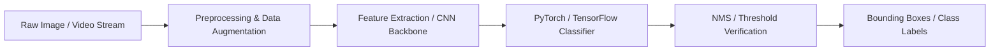

<div align="center">

  <!-- Hero Banner Placeholder -->
  

  # 🤖 AI & Computer Vision Lab

  [](LICENSE)
  [](https://python.org/)
  [](https://tensorflow.org/)
  [](https://pytorch.org/)
  [](https://opencv.org/)

  <p align="center">
    A curated playground and research lab containing computer vision pipelines, deep learning image classification architectures, classical machine learning benchmarks, and NLP experimental notebooks.
  </p>

</div>

---

## 📌 Repository Overview

The **AI & Computer Vision Lab** serves as a central hub for **Jihan Azaria Bibi's** research experiments, model architectures, and practical machine learning applications. From building custom Convolutional Neural Networks (CNNs) in PyTorch to real-time object tracking with OpenCV and classical Scikit-Learn data science pipelines, this repository houses end-to-end reproducible machine learning code.

---

## ✨ Key Modules & Experiments

### 👁️ 1. Computer Vision & Image Processing
- **Real-Time Facial & Object Detection:** OpenCV Haar Cascade and DNN module implementations with webcam feeds.
- **Custom Image Classification:** PyTorch ResNet & MobileNet fine-tuning for custom multi-class datasets.
- **Image Segmentation:** U-Net implementation for pixel-level semantic segmentation.

### 🧠 2. Deep Learning Architectures
- **CNNs from Scratch:** Building convolutional layers, pooling, and custom loss functions in PyTorch/TensorFlow.
- **Transfer Learning Benchmarks:** Comparing accuracy and latency of ResNet50, EfficientNet, and MobileNetV3.

### 📊 3. Machine Learning & Data Science
- **Supervised & Unsupervised Learning:** Scikit-Learn pipelines for classification (Random Forest, SVM, XGBoost) and clustering (K-Means, DBSCAN).
- **Data Preprocessing & EDA:** Comprehensive Jupyter Notebooks utilizing Pandas, NumPy, Seaborn, and Matplotlib.

### 💬 4. Natural Language Processing (NLP)
- **Text Classification & Sentiment Analysis:** TF-IDF + Logistic Regression vs. Transformer-based tokenization models.

---

## 🛠️ Tech Stack & Frameworks

| Domain | Tools & Libraries |
| :--- | :--- |
| **Core Language** | Python 3.10+ |
| **Deep Learning** | PyTorch, TensorFlow, Keras |
| **Computer Vision** | OpenCV, PIL (Pillow), Albumentations |
| **ML & Analytics** | Scikit-learn, Pandas, NumPy, SciPy |
| **Visualization** | Matplotlib, Seaborn, Plotly |
| **Environment** | Google Colab, Jupyter Notebooks, VS Code |

---

## 🏗️ Computer Vision Pipeline



---

## 🖼️ Experiment Visualizations

<div align="center">

| Object Detection Output | Confusion Matrix & Loss Curves | Data Distribution Plots |
| :---: | :---: | :---: |
| `` | `` | `` |

</div>

---

## 📁 Repository Structure

```text
ai-computer-vision-lab/
├── computer_vision/           # OpenCV & Object Detection
│   ├── face_recognition/      # Real-time face detection scripts
│   ├── object_tracking/       # YOLO & OpenCV tracking algorithms
│   └── segmentation/          # U-Net image segmentation
├── deep_learning/             # PyTorch & TensorFlow models
│   ├── cnn_scratch/           # Custom CNN architecture notebooks
│   └── transfer_learning/     # Fine-tuning ResNet & MobileNet
├── machine_learning/          # Scikit-learn pipelines & EDA
│   ├── classification/        # Random Forest, SVM & Evaluation
│   └── eda_notebooks/         # Exploratory Data Analysis
├── nlp_experiments/           # Sentiment analysis & text classifiers
├── requirements.txt           # Python dependencies
└── README.md
```

---

## 🚀 Getting Started & Installation

### 1. Clone the Repository
```bash
git clone https://github.com/jjaehn/ai-computer-vision-lab.git
cd ai-computer-vision-lab
```

### 2. Create Virtual Environment
```bash
python -m venv venv
source venv/bin/activate  # On Windows: venv\Scripts\activate
```

### 3. Install Dependencies
```bash
pip install -r requirements.txt
```

### 4. Run Notebooks or Scripts
To launch Jupyter Notebook:
```bash
jupyter notebook
```
To run a specific Computer Vision script:
```bash
python computer_vision/face_recognition/detect.py
```

---

## 🔮 Future Research Directions

- [ ] Implement Edge AI deployment on ESP32-CAM using TensorFlow Lite Micro.
- [ ] Add YOLOv8 custom object detection training pipeline.
- [ ] Explore Vision Transformers (ViT) for fine-grained image classification.

---

## 📜 License

Distributed under the MIT License. See `LICENSE` for details.

---

## 👤 Author

**Jihan Azaria Bibi**  
- GitHub: [@jjaehn](https://github.com/jjaehn)  
- LinkedIn: [Jihan Azaria Bibi](https://www.linkedin.com/in/jihanazariabibi)  
- Email: [azariajihan36@gmail.com](mailto:azariajihan36@gmail.com)
