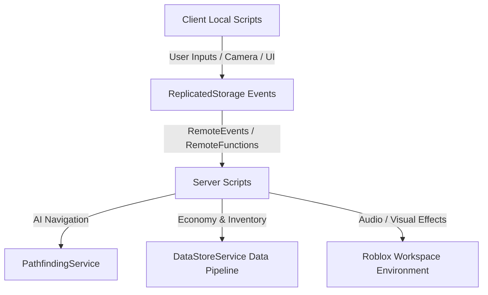

<div align="center">

  <!-- Hero Banner Placeholder -->
  

  # 👺 Before Satan Catch You — Roblox Horror Survival Game

  [](https://roblox.com/)
  [](https://luau-lang.org/)
  []()
  []()

  <p align="center">
    An atmospheric, pulse-pounding 3D multiplayer horror survival game built in Roblox Studio, featuring dynamic enemy AI tracking, resource management, and economic survival mechanics.
  </p>

</div>

---

## 📌 Game Overview

**Before Satan Catch You** is a survival horror game developed on the Roblox platform. Players find themselves trapped inside a dark, maze-like environment where an unpredictable demonic entity relentlessly pursues them using custom pathfinding AI. 

To survive, players must manage limited battery light, scavenge for economic resources, unlock secure rooms, and balance strategic spending at survival vending nodes before time runs out.

---

## ✨ Core Gameplay Features

- 🧠 **Dynamic Enemy AI Pathfinding:** Utilizes Roblox PathfindingService with custom behavior trees for unpredictable hunting, ambient listening, and line-of-sight chasing.
- 💰 **In-Game Economic Survival:** Earn currency by discovering hidden relics and surviving time intervals. Spend funds on flashlights, speed boots, and stamina boosters.
- 🔦 **Atmospheric Lighting & Sound Engine:** Dynamic atmospheric fog, custom spatial 3D audio cues, and light battery depletion mechanics to maximize tension.
- 🗝️ **Multi-Objective Puzzles:** Find keycards, repair generators, and execute environmental interactions to unlock escape routes.
- 👥 **Multiplayer Co-op & Spectator Mode:** Play with friends in real-time or spectate remaining survivors once eliminated.

---

## 🛠️ Technical Stack

- **Game Engine:** Roblox Studio
- **Scripting Language:** Luau (Statically Typed Lua variant)
- **Frameworks & Services:** DataStoreService (Player persistence), PathfindingService, SoundService, TweenService, UserInputService
- **3D Modeling & Assets:** Blender / Roblox CSG (Solid Modeling)
- **UI/UX Design:** Roblox ScreenGui, Custom Frame Animations

---

## 🏗️ Technical Architecture & Script Structure



---

## 🖼️ Game Screenshots

<div align="center">

| Atmosphere & Lighting | Enemy AI Chase Scene | Shop & Economic UI |
| :---: | :---: | :---: |
| `` | `` | `` |

</div>

---

## 📁 Repository Structure

```text
before-satan-catch-you/
├── src/
│   ├── ServerScriptService/       # Server-authoritative logic
│   │   ├── AIController.server.luau # Enemy pathfinding & state machine
│   │   ├── EconomySystem.server.luau# Currency, shops & transactions
│   │   └── DataHandler.server.luau  # DataStore saving/loading
│   ├── ReplicatedStorage/         # Shared modules & remote events
│   │   ├── NetworkEvents/         # RemoteEvents for client-server communication
│   │   └── Modules/               # Shared utility functions
│   └── StarterPlayer/
│       └── StarterPlayerScripts/  # Client UI, Sound & Flashlight controls
├── assets/                        # 3D Models (.rbxm) & Audio IDs
└── README.md
```

---

## 🕹️ How to Run / Play

### Playing on Roblox
1. Visit the published Roblox game page: *[Insert Game Link Here]*
2. Click **Play** to join a live server.

### Local Development in Roblox Studio
1. Clone this repository or download `.rbxl` place file.
2. Open **Roblox Studio**.
3. Open `place.rbxl` or import scripts via **Rojo** sync tool:
   ```bash
   rojo serve
   ```
4. Press **F5** in Roblox Studio to start Local Playtest.

---

## 🔮 Future Development Roadmap

- [ ] Add multiple difficulty modes (Normal, Nightmare, Hardcore).
- [ ] Implement procedural maze generation for randomized gameplay layouts.
- [ ] Introduce character perks and unlockable cosmetic skins.
- [ ] Expand lore with hidden audio logs scattered throughout the map.

---

## 📜 License

Content and code are available under the MIT License. Game assets belong to their respective creators.

---

## 👤 Author

**Jihan Azaria Bibi**  
- GitHub: [@jjaehn](https://github.com/jjaehn)  
- LinkedIn: [Jihan Azaria Bibi](https://linkedin.com/in/jihan-azaria-bibi)  
- Email: [jihanazaria.work@gmail.com](mailto:jihanazaria.work@gmail.com)
