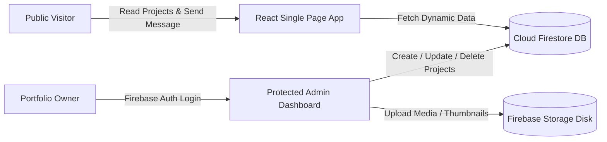

<div align="center">

  <!-- Hero Banner Placeholder -->
  

  # 💼 Personal Portfolio Website & Admin CMS

  [](LICENSE)
  [](https://reactjs.org/)
  [](https://vitejs.dev/)
  [](https://tailwindcss.com/)
  [](https://firebase.google.com/)

  <p align="center">
    A modern, glassmorphic portfolio web application designed for high performance, featuring an integrated admin CMS dashboard to dynamically manage projects, skill analytics, and incoming contact inquiries.
  </p>

</div>

---

## 📌 Project Overview

This repository powers **Jihan Azaria Bibi's** personal developer portfolio website ([https://jihanazariaa.vercel.app/](https://jihanazariaa.vercel.app/)). Built with **React 18**, **Vite**, **Tailwind CSS**, and **Firebase**, this application combines sleek dark-mode aesthetic design with a secure, password-protected Admin Dashboard. 

Rather than editing hardcoded JSON files to update portfolio content, the admin panel allows seamless CRUD management of featured projects, tech stack categories, experience timelines, and visitor messages in real-time.

---

## ✨ Key Features

- 🎨 **Modern Dark-Mode Design:** Glassmorphism UI, smooth scroll animations, curated color palettes, and responsive layouts.
- 🛠️ **Custom Admin CMS Dashboard:** Secure authentication panel allowing the owner to add, edit, or feature projects without redeploying code.
- 📂 **Interactive Project Gallery:** Categorized project cards with tech badges, live demo links, GitHub source buttons, and modal detail views.
- 📊 **Dynamic Skill Progress Visualizer:** Interactive tech stack showcase categorized into AI/ML, Full Stack, Languages, and Hardware.
- 📩 **Contact Form with Firebase Integration:** Direct visitor message delivery with real-time notifications in the admin console.
- ⚡ **Lightning Fast Performance:** Optimized asset bundles with Vite and seamless deployment via Vercel/Netlify.

---

## 🛠️ Tech Stack

| Domain | Tech Stack |
| :--- | :--- |
| **Frontend** | React 18, Vite, Tailwind CSS, Lucide Icons, Framer Motion |
| **Backend / BaaS** | Firebase Authentication, Cloud Firestore, Firebase Storage |
| **Hosting & CI/CD** | Vercel / Netlify with GitHub automatic deployments |
| **Code Quality** | ESLint, Prettier, PostCSS |

---

## 🏗️ Architecture Diagram



---

## 🖼️ User Interface Screenshots

<div align="center">

| Public Hero Section | Interactive Projects Section | Protected Admin CMS |
| :---: | :---: | :---: |
| `` | `` | `` |

</div>

---

## 📁 Folder Structure

```text
jie-s-porto/
├── public/                    # Static assets & favicons
├── src/
│   ├── assets/                # Logos, SVG icons, background images
│   ├── components/            # Reusable UI components
│   │   ├── Navbar.jsx         # Navigation bar with dark mode toggle
│   │   ├── ProjectCard.jsx    # Glassmorphic project item
│   │   └── ProtectedRoute.jsx # Auth wrapper for Admin pages
│   ├── pages/
│   │   ├── Home.jsx           # Public Portfolio landing page
│   │   └── AdminDashboard.jsx # CMS for managing content
│   ├── services/
│   │   └── firebase.js        # Firebase SDK initialization
│   ├── App.jsx
│   └── main.jsx
├── index.html
├── vite.config.js
└── README.md
```

---

## 🚀 Installation & Local Development Setup

### 1. Clone the Repository
```bash
git clone https://github.com/jjaehn/jie-s-porto.git
cd jie-s-porto
```

### 2. Install Dependencies
```bash
npm install
```

### 3. Setup Firebase Environment Variables
Create a `.env` file in the root folder:
```env
VITE_FIREBASE_API_KEY=your_api_key
VITE_FIREBASE_AUTH_DOMAIN=your_project_id.firebaseapp.com
VITE_FIREBASE_PROJECT_ID=your_project_id
VITE_FIREBASE_STORAGE_BUCKET=your_project_id.appspot.com
VITE_FIREBASE_MESSAGING_SENDER_ID=your_sender_id
VITE_FIREBASE_APP_ID=your_app_id
```

### 4. Start Local Dev Server
```bash
npm run dev
```
Open `http://localhost:5173` in your browser.

---

## 🔮 Future Enhancements

- [ ] Add Blog / Tech Notes section with Markdown parser.
- [ ] Add visitor traffic analytics visualization inside the Admin CMS.
- [ ] Integrate GitHub GraphQL API to automatically fetch live commit counts and star metrics.

---

## 📜 License

Distributed under the MIT License. See `LICENSE` for details.

---

## 👤 Author

**Jihan Azaria Bibi**  
- GitHub: [@jjaehn](https://github.com/jjaehn)  
- LinkedIn: [Jihan Azaria Bibi](https://www.linkedin.com/in/jihanazariabibi)  
- Website: [jihanazariaa.vercel.app](https://jihanazariaa.vercel.app/)  
- Email: [azariajihan36@gmail.com](mailto:azariajihan36@gmail.com)
