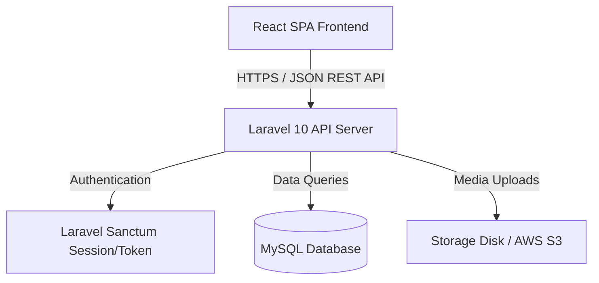

<div align="center">

  <!-- Hero Banner Placeholder -->
  

  # ♻️ Recreo — Interactive Recycling & Eco-Learning Platform

  [](LICENSE)
  [](https://laravel.com/)
  [](https://reactjs.org/)
  [](https://tailwindcss.com/)
  [](https://mysql.com/)

  <p align="center">
    A modern web application empowering communities to recycle smarter through interactive tutorials, creative DIY upcycling guides, and gamified eco-impact tracking.
  </p>

</div>

---

## 📌 Project Overview

**Recreo** is an educational eco-platform created to address waste management awareness through interactive digital learning. By pairing actionable step-by-step upcycling DIY guides with a gamified waste sorting engine, Recreo makes sustainability engaging for students, households, and environmentally conscious users.

Built with a robust **Laravel** REST API backend, a responsive **React** single-page frontend, and styled with **Tailwind CSS**, Recreo provides seamless user journeys from waste identification to creative DIY project completion.

---

## ✨ Key Features

- 📚 **Interactive DIY Upcycling Library:** Filterable step-by-step guides for recycling plastic, paper, glass, and electronic waste into functional home craft projects.
- 🔍 **Smart Waste Classification Guide:** Searchable directory educating users on waste categories (recyclable, organic, hazardous) and proper disposal methods.
- 🏆 **Gamified Eco Progress Tracker:** User profile dashboards tracking completed DIY projects, estimated CO2 reduction, and earned green badges.
- 💬 **Community Project Showcase:** Platform where users can publish their own completed upcycling creations and exchange ideas.
- ⚙️ **Admin Management Portal:** Dynamic CMS for moderators to add, update, and manage tutorials, categories, and user submissions.

---

## 🛠️ Tech Stack

| Domain | Technologies |
| :--- | :--- |
| **Frontend** | React 18, Vite, Tailwind CSS, Lucide Icons, Axios |
| **Backend** | Laravel 10, PHP 8.2, Eloquent ORM, Sanctum Auth |
| **Database** | MySQL 8.0 / PostgreSQL |
| **Tooling & Design** | Git, GitHub, Figma, Postman |

---

## 🏗️ System Architecture



---

## 🖼️ User Interface Screenshots

<div align="center">

| Homepage & Catalog | Step-by-Step DIY Tutorial | Eco Dashboard |
| :---: | :---: | :---: |
| `` | `` | `` |

</div>

---

## 📁 Folder Structure

```text
recreo-web/
├── backend/                  # Laravel 10 Core Application
│   ├── app/
│   │   ├── Http/Controllers/ # REST Controllers (Tutorial, Waste, User)
│   │   └── Models/           # Eloquent Models & Relationships
│   ├── database/
│   │   ├── migrations/       # Schema definitions
│   │   └── seeders/          # Sample eco tutorials & categories
│   └── routes/api.php        # API Endpoints
├── frontend/                 # React SPA
│   ├── src/
│   │   ├── components/       # UI Components (Navbar, Cards, Modals)
│   │   ├── pages/            # Page Views (Home, Tutorials, Dashboard)
│   │   └── services/         # Axios API clients
│   └── tailwind.config.js    # Design System & Color Tokens
└── README.md
```

---

## 🚀 Installation & Setup

### Prerequisites
- Node.js (v18+) & npm
- PHP (v8.2+) & Composer
- MySQL Database Engine

### 1. Backend Setup (Laravel)
```bash
cd backend
composer install
cp .env.example .env
```
Configure your database credentials in `.env`:
```env
DB_CONNECTION=mysql
DB_HOST=127.0.0.1
DB_PORT=3306
DB_DATABASE=recreo_db
DB_USERNAME=root
DB_PASSWORD=
```
Run migrations and seeders:
```bash
php artisan key:generate
php artisan migrate --seed
php artisan serve
```

### 2. Frontend Setup (React)
```bash
cd frontend
npm install
npm run dev
```
Open `http://localhost:5173` in your browser.

---

## 🔮 Future Improvements

- [ ] AI-Powered Waste Scanner: Integrate a Mobile camera computer vision model to automatically categorize waste materials from photos.
- [ ] Local Recycling Drop-off Map: Integrate Google Maps API to locate nearest recycling banks.
- [ ] Social Leaderboard: Weekly community challenges for top upcyclers.

---

## 📜 License

Distributed under the MIT License. See `LICENSE` for details.

---

## 👤 Author

**Jihan Azaria Bibi**  
- GitHub: [@jjaehn](https://github.com/jjaehn)  
- LinkedIn: [Jihan Azaria Bibi](https://www.linkedin.com/in/jihanazariabibi)  
- Email: [azariajihan36@gmail.com](mailto:azariajihan36@gmail.com)
