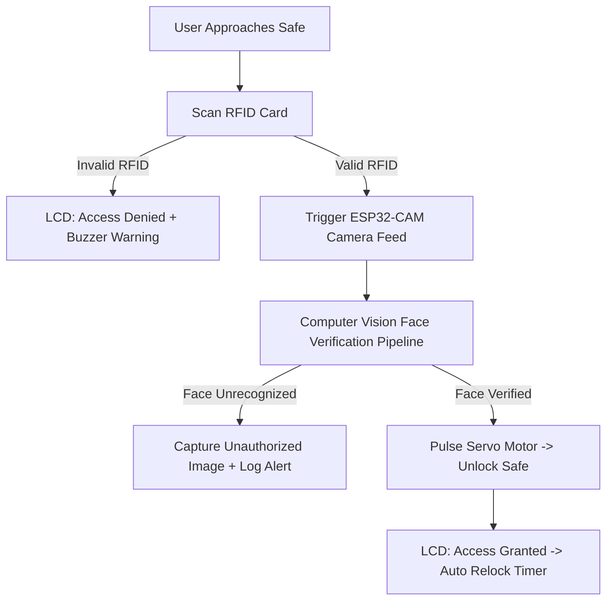

<div align="center">

  <!-- Hero Banner Placeholder -->
  

  # 🔐 Smart Safe — IoT & Computer Vision Security System

  [](LICENSE)
  [](https://www.espressif.com/)
  [](https://opencv.org/)
  []()

  <p align="center">
    An intelligent, dual-factor physical security system combining <b>ESP32-CAM microcontrollers</b>, <b>Computer Vision facial verification</b>, <b>RFID access control</b>, and real-time hardware status indicators.
  </p>

</div>

---

## 📌 Project Overview

**Smart Safe** is an end-to-end IoT security solution engineered to elevate traditional physical safes into smart, multi-layered security hubs. Built using the **ESP32-CAM** module, the system requires both valid physical RFID credentials and Computer Vision face recognition before triggering the high-torque servo locking mechanism.

If unauthorized tampering or unrecognized facial access is detected, the safe logs the event, displays real-time status warnings on the LCD display, and prevents unauthorized entry.

---

## ✨ Key Features

- 🔑 **Dual-Factor Authentication (2FA):** Combines RFID tag scanning (something you have) with facial recognition (something you are).
- 📷 **Real-Time Computer Vision:** Processes video feeds via OpenCV to detect and verify registered user faces.
- 🔒 **Servo Lock Mechanism:** Controls physical deadbolts via PWM signals driven by microcontrollers.
- 🖥️ **I2C LCD Display Interface:** Provides live user diagnostics (e.g., "Scan RFID", "Verifying Face...", "Access Granted", "Access Denied").
- 🚨 **Tamper Alert & Event Logging:** Captures snapshots of unauthorized access attempts and logs timestamps.
- ⚡ **Low Power Edge Processing:** Designed for efficient power usage across IoT microcontrollers.

---

## 🛠️ Tech Stack & Hardware Components

| Category | Technologies / Components |
| :--- | :--- |
| **Microcontroller** | ESP32-CAM (Wi-Fi + Bluetooth + Camera Module) |
| **Sensors & Input** | MFRC522 RFID Reader, ESP32 Camera Module |
| **Actuators & Displays** | SG90 / MG996R Servo Motor, 16x2 I2C LCD Display |
| **Software & AI** | C++ (Arduino IDE/PlatformIO), Python 3.x, OpenCV, NumPy |
| **Communication** | HTTP / WebSockets / Serial Communication |

---

## 🏗️ System Architecture



---

## 🖼️ Screenshots & Hardware Setup

<div align="center">

| Hardware Assembly | Face Recognition Pipeline | LCD Diagnostic Display |
| :---: | :---: | :---: |
| `` | `` | `` |

</div>

---

## 📁 Folder Structure

```text
smart-safe-iot/
├── hardware/                  # ESP32-CAM Firmware (Arduino / C++)
│   ├── main_esp32/            # Main pin definitions & sensor polling
│   ├── rfid_module.cpp        # MFRC522 SPI communications
│   ├── lcd_display.cpp        # I2C display helpers
│   └── servo_controller.cpp   # Lock PWM logic
├── cv_server/                 # Python OpenCV Processing Node
│   ├── app.py                 # Flask / FastAPI video stream handler
│   ├── face_recognizer.py     # Facial embedding extraction & verification
│   ├── dataset/               # Authorized user embeddings / images
│   └── requirements.txt       # Python dependencies
├── docs/                      # Circuit schematics & CAD pinouts
└── README.md                  # Project Documentation
```

---

## 🚀 Installation & Setup

### 1. Hardware Flashing (ESP32-CAM)
1. Open `hardware/main_esp32` in **Arduino IDE** or **VS Code (PlatformIO)**.
2. Install dependencies: `MFRC522`, `LiquidCrystal_I2C`, and `ESP32 Board Manager`.
3. Set your Wi-Fi credentials in `config.h`:
   ```cpp
   const char* ssid = "YOUR_WIFI_SSID";
   const char* password = "YOUR_WIFI_PASSWORD";
   ```
4. Flash the code to the ESP32-CAM module via FTDI programmer.

### 2. Python Computer Vision Server Setup
1. Clone the repository:
   ```bash
   git clone https://github.com/jjaehn/smart-safe-iot.git
   cd smart-safe-iot/cv_server
   ```
2. Create and activate a virtual environment:
   ```bash
   python -m venv venv
   source venv/bin/activate  # On Windows: venv\Scripts\activate
   ```
3. Install requirements:
   ```bash
   pip install -r requirements.txt
   ```
4. Run the CV server:
   ```bash
   python app.py
   ```

---

## 🔮 Future Improvements

- [ ] Add Telegram / WhatsApp instant notification bot with intruder snapshot attached.
- [ ] Implement cloud backup for access logs using Firebase Realtime Database.
- [ ] Add capacitive touch keypad as a backup PIN method.
- [ ] Optimize face recognition model using TensorFlow Lite for Microcontrollers (TFLite Micro) directly on-device.

---

## 📜 License

Distributed under the MIT License. See `LICENSE` for more information.

---

## 👤 Author

**Jihan Azaria Bibi**  
- GitHub: [@jjaehn](https://github.com/jjaehn)  
- LinkedIn: [Jihan Azaria Bibi](https://linkedin.com/in/jihan-azaria-bibi)  
- Email: [jihanazaria.work@gmail.com](mailto:jihanazaria.work@gmail.com)
